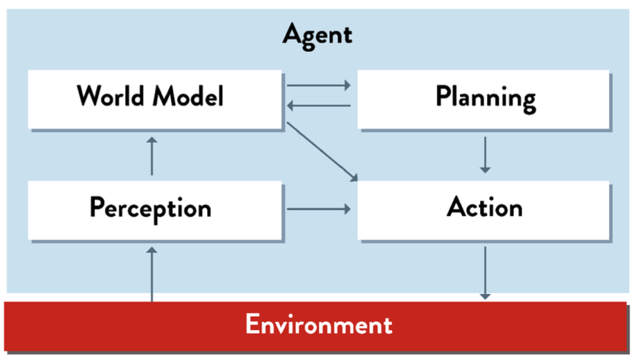

**Agent types**
There are 5 types:
 - Reactive Agent  
 - Model- Based Agent  
 - Planing Agent  
 - Game Playing Agent  
 - Learning Agent  

**Agent Model**

**Reactive Agent**

 - Definition: Reactive agents refers to a type of agent that reacts directly to environmental stimuli without the need for internal state representation or planning. These agents are often designed to operate in real-time and exhibit behavior that is driven by immediate sensory input.  
 - Limitation: no memory or "state", therefore, it unable to base decisions on past experiences and repeat the same sequence of actions.

**Model-Based Agent**

 - Advantage: Model-Based Agent can keep a “map” of the places it has visited, and remember what it perceived there.  
 - Limitation: An agent with a world model but no planning can look into the past, but not into the future; it will perform poorly when the task requires any of the following:
	- searching several moves ahead. Example: Chess, Rubik’s cube
	- complex tasks requiring many individual steps. Example: cooking a meal, assembling a watch
	- logical reasoning to achieve goals. Example: travel to New York

**Planing Agent**

 